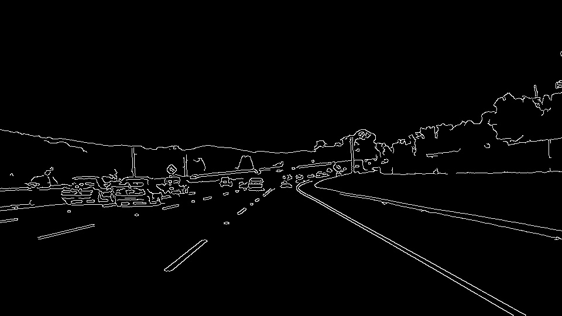
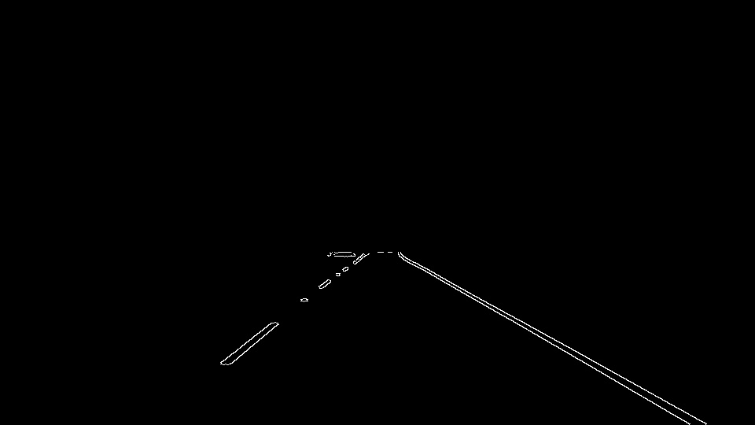
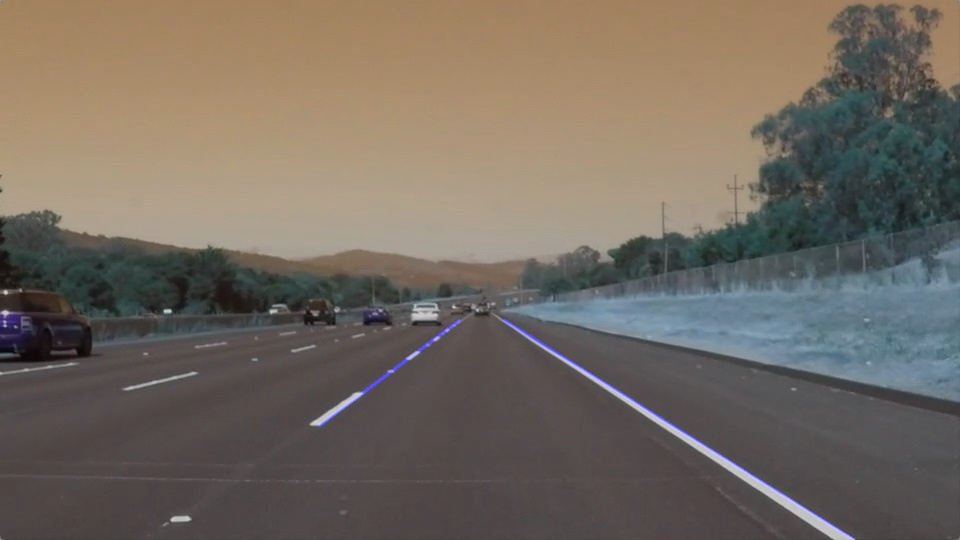

# **Finding Lane Lines on the Road** 

## Writeup Template

### You can use this file as a template for your writeup if you want to submit it as a markdown file. But feel free to use some other method and submit a pdf if you prefer.

---

**Finding Lane Lines on the Road**

The goals / steps of this project are the following:
* Make a pipeline that finds lane lines on the road
* Reflect on your work in a written report

---

### **Reflection**

### 1. Describe your pipeline. As part of the description, explain how you modified the draw_lines() function.

My pipeline consisted of 5 steps. 
1. First I copy the image and tranfer it to gray scale.\

2. Next I apply a gaussian blur to smooth the edges.\

3. As next step I create lower and upper threshold for the _Canny Transformation_ and apply it to the image.\

4. As next step I greate a _mask_ to remove the area which is not of interest for the __lane marking__.\

5. In the last step I apply the _Hough Transformation_ and plot the left and right __lane marking__ on the original image.\

In order to draw a single line on the left and right lanes, I modified the draw_lines() function:
* Created one line for the left and right side by separating the lines based on their slope
* Then evaluating the lowest and highest detected point of the line.
* as last step extrapolate the highest point to the end of the image

### 2. Identify potential shortcomings with your current pipeline

One potential shortcoming would be what would happen when and other line is close to the original line.
This can be seen in some scenes in the video where the _road edge_ in the distance is close to the lane line.
Then it sometimes _jumps_ back and forth.

Another shortcoming is that the lanes jump, so a control algorythm would need to filter the input of the lane finding.

Additionally in the __draw_lines__ algorythm only the lowest and highest points are considered.
Which also results into _jumping_ of the lane marking.

Lastly if the road is very straight and long, the masked area is limiting the length of the lane that can be found.

### 3. Suggest possible improvements to your pipeline

A possible improvement would be to average the lines and use the average slope of all left points.
Also the same for the right side of the lane marking.

Another potential improvement could be to include a filter into the algorythm to minimize jumping of the lines.

Further a dynamic _region of interest_ algorythim could help to increase the performance in good visibility patterns,
and reduce the misdetection in difficult situations, for example with preceeding traffic.
